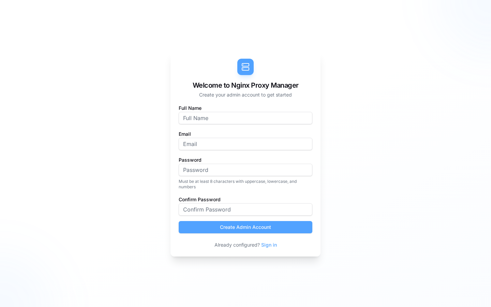
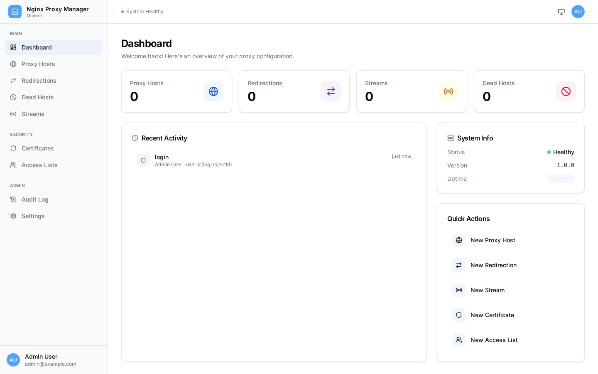
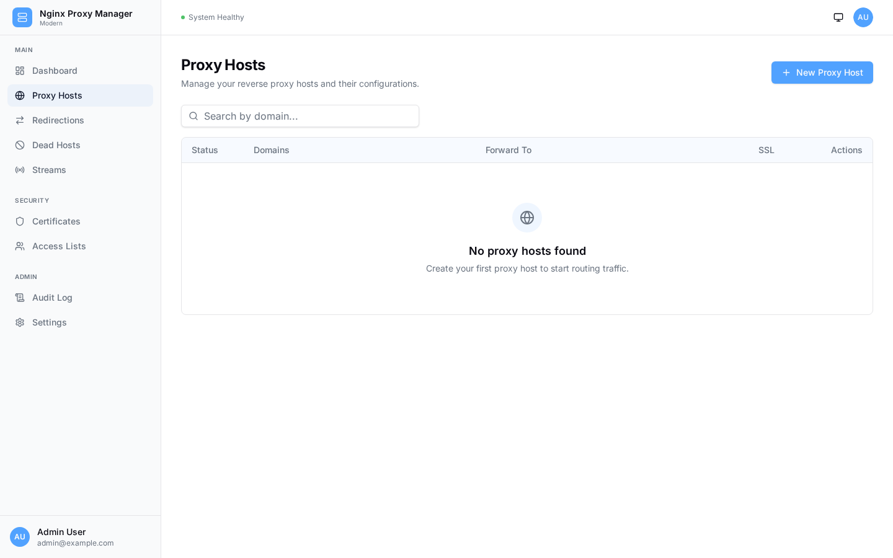
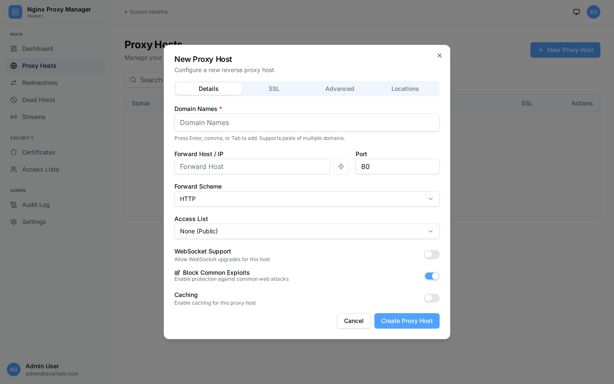
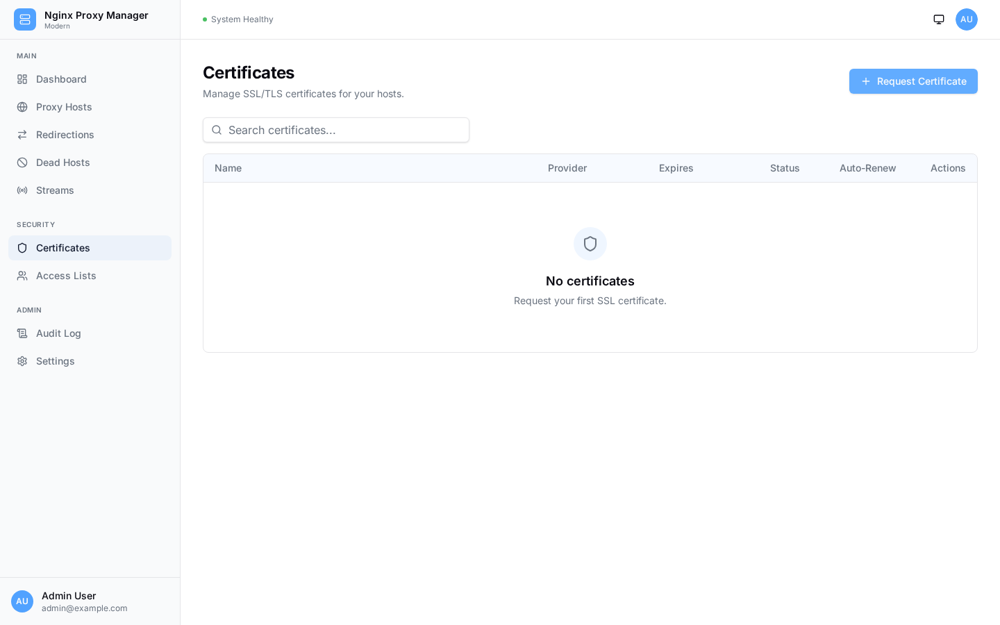
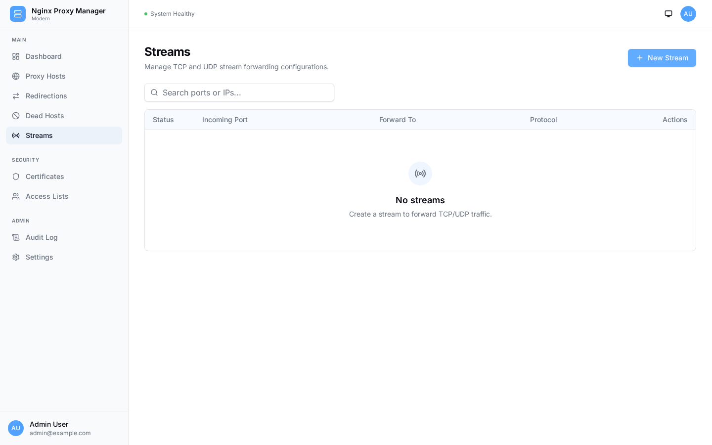
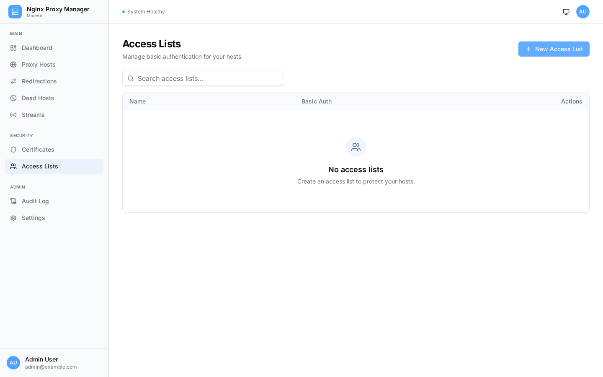
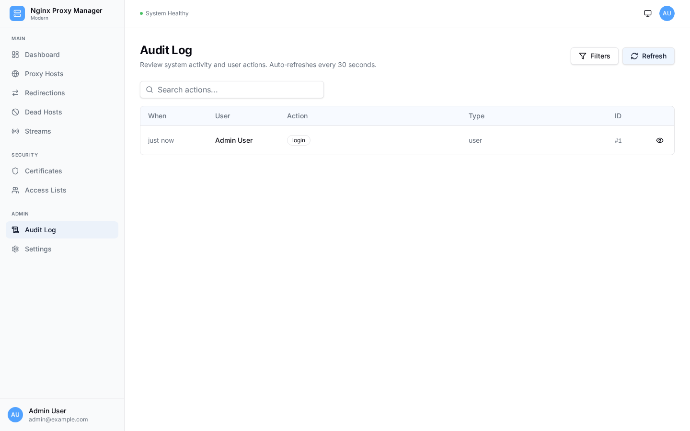
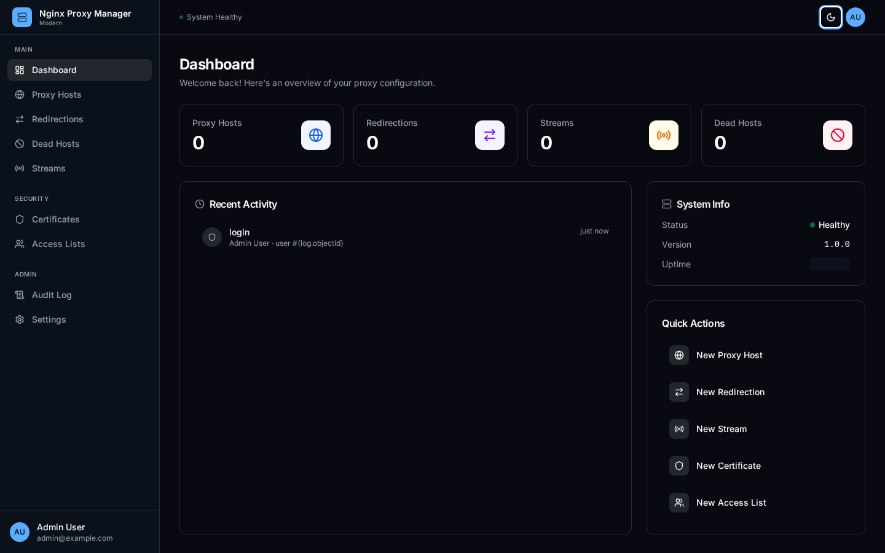

<p align="center">
  
</p>

<h1 align="center">Nginx Proxy Manager Modern</h1>

<p align="center">
  <strong>A modern, clean, and powerful Nginx reverse proxy manager</strong><br>
  <em>Full-featured web UI for managing Nginx reverse proxies, SSL certificates, and access control — all in one elegant interface.</em>
</p>

<p align="center">
  
  
  
  
  
  
  
</p>

---

## Features

### Proxy Management
- **Proxy Hosts** - Configure reverse proxy with domain, forward host/port, scheme selection
- **Stream Proxies** - TCP and UDP stream forwarding for databases, game servers, and more
- **Redirection Hosts** - HTTP redirection with 301/302/303/307/308 status code support
- **Dead Hosts** - Serve custom pages for domains that should not resolve publicly
- **Custom Locations** - Per-host location blocks with individual proxy targets
- **Advanced Config** - Inject raw Nginx directives per host for advanced use cases

### SSL / TLS
- **Let's Encrypt** - Automatic certificate provisioning and renewal via ACME
- **Custom Certificates** - Upload your own SSL certificates and private keys
- **SSL Forcing** - Automatic HTTP to HTTPS redirect per host
- **HSTS** - HTTP Strict Transport Security with subdomain inclusion
- **HTTP/2** - Enable HTTP/2 protocol support per host
- **Certificate Monitoring** - Track expiry status and auto-renew expiring certificates

### Security & Access Control
- **Access Lists** - IP allow/deny rules with basic auth support per proxy host
- **Block Exploits** - Built-in protection against common web attacks
- **Trust Forwarded Proto** - Correct client IP detection behind load balancers
- **JWT Authentication** - Secure token-based API authentication
- **Rate Limiting** - Brute-force protection on login endpoints
- **RBAC** - Role-based access control for multi-user environments

### User & Dashboard
- **User Management** - Create and manage users with admin/viewer roles
- **Modern UI** - Clean responsive dashboard built with React, Tailwind CSS, and shadcn/ui
- **Dark Mode** - Full dark mode support with system-preference detection
- **Dashboard Stats** - Overview of proxy hosts, streams, certificates, and active users
- **Audit Log** - Track all system events, configuration changes, and user actions

### Infrastructure
- **Docker Native** - Fully containerised with multi-service Compose setup
- **Auto Reload** - inotify-based config watcher detects changes and reloads Nginx automatically
- **Health Checks** - Native Docker health checks with service dependency ordering
- **IP Ranges** - CloudFront and Cloudflare IP ranges auto-refresh every 6 hours
- **Log Rotation** - Built-in logrotate for Nginx access and error logs
- **SQLite Database** - Zero-config embedded database, auto-migration on startup

---

<details>
<summary>Screenshots</summary>

### Login



### Dashboard



### Proxy Hosts



### Proxy Host Form



### Certificates



### Stream Proxies



### Access Lists



### Audit Log



### Dark Mode



</details>

---

<details>
<summary>Requirements & Installation</summary>

### Requirements

| Component | Requirement |
|-----------|-------------|
| **Runtime** | Docker + Docker Compose |
| **Build (optional)** | Node.js 22+, npm 10+, Git |
| **OS** | Linux (Ubuntu/Debian recommended), macOS, or WSL2 |

### Docker (Recommended)

```bash
# Clone the repository
git clone https://github.com/fahimahamed1/nginx-proxy-manager.git
cd nginx-proxy-manager/docker

# Build and start all services
docker compose up -d --build
```

Access the admin UI at **http://your-server-ip:81**

### Using Make

```bash
git clone https://github.com/fahimahamed1/nginx-proxy-manager.git
cd nginx-proxy-manager

# Build Docker images and start
make docker-up-build
```

### Available Make Commands

```bash
make help                # Show all available commands
make docker-up           # Start all services in detached mode
make docker-down         # Stop all services
make docker-restart      # Restart all services
make docker-build        # Build Docker images
make docker-up-build     # Build and start everything
make docker-logs         # Tail logs from all services
make docker-nginx-logs   # Tail Nginx logs only
make docker-backend-logs # Tail backend logs only
make docker-shell-nginx  # Open shell in Nginx container
make docker-shell-backend# Open shell in backend container
make docker-prune        # Remove images and unused Docker resources
make clean-all           # Clean everything including containers
```

> First launch opens a setup wizard to create your admin account. No default credentials exist.

</details>

---

<details>
<summary>Configuration</summary>

### Environment Variables

| Variable | Default | Description |
|----------|---------|-------------|
| `TZ` | `UTC` | Server timezone (e.g., `Europe/London`, `Asia/Dhaka`) |
| `DISABLE_IPV6` | `false` | Disable IPv6 listener in Nginx |
| `CORS_ORIGINS` | `http://localhost:81` | Allowed CORS origins for the API |

### Ports

| Port | Protocol | Description |
|------|----------|-------------|
| `80` | TCP | HTTP — proxy traffic and Let's Encrypt ACME challenges |
| `81` | TCP | Admin UI — management dashboard |
| `443` | TCP | HTTPS — SSL/TLS encrypted proxy traffic |

### Volumes

| Volume | Container Path | Description |
|--------|---------------|-------------|
| `npm-data` | `/data` | Database, Nginx configs, logs, and custom SSL certs |
| `npm-letsencrypt` | `/etc/letsencrypt` | Let's Encrypt certificates and account data |
| `npm-nginx-include` | `/etc/nginx/conf.d/include` | Shared Nginx config snippets (IP ranges, resolvers) |

### Data Directory Structure

```
/data/
  database.sqlite                  # Application database (auto-created)
  nginx/
    proxy_host/*.conf              # Per-domain reverse proxy configs
    redirection_host/*.conf        # HTTP redirection configs
    dead_host/*.conf               # Dead host configs
    stream/*.conf                  # TCP/UDP stream configs
    custom/*.conf                  # User-defined custom Nginx configs
    default_host/*.conf            # Default site configuration
    default_www/                   # Default site HTML content
    temp/                          # Temporary config staging
  access/                          # Access list definitions
  custom_ssl/                      # Custom uploaded SSL certificates
  logs/                            # Nginx and application logs
  keys/                            # JWT RSA key pair (auto-generated)
  letsencrypt-acme-challenge/      # ACME challenge webroot
```

</details>

---

<details>
<summary>How to Use</summary>

### Initial Setup

1. Deploy with Docker: `docker compose up -d --build`
2. Open **http://your-server-ip:81** in your browser
3. Complete the setup wizard — create admin account with name, email, and password
4. You are now on the dashboard

### Managing Proxy Hosts

- Click **Proxy Hosts** in the sidebar
- Click **Add Proxy Host**
- Enter domain name(s), forward host, forward port, and scheme
- Optionally configure SSL, access lists, caching, and advanced settings
- Click **Save** — Nginx config is generated and hot-reloaded automatically

### SSL Certificates

- Navigate to **Certificates** in the sidebar
- Click **Add Certificate**
- Choose **Let's Encrypt** — enter domain(s) and email, agree to ToS
- Or choose **Custom** — paste your certificate and private key
- Certificates auto-renew 30 days before expiry

### Stream Proxies

- Click **Streams** in the sidebar
- Configure incoming port, forward IP, and forwarding port
- Toggle TCP/UDP forwarding as needed
- Save to activate immediately

### Access Lists

- Create access lists with IP allow/deny rules
- Add basic auth credentials (username/password)
- Assign access lists to any proxy host for fine-grained control

### User Management

- Navigate to **Users** in the sidebar (admin only)
- Create users with **Admin** or **Viewer** role
- Admins have full access; Viewers are read-only
- Visibility permissions control which host types each user can see

### Audit Log

- View all system events under **Audit Log** in the sidebar
- Filter by action type, object type, or search keywords
- Tracks configuration changes, user logins, and system events

</details>

---

<details>
<summary>Tech Stack</summary>

| Layer | Technology |
|-------|-----------|
| **Frontend** | React 19, TypeScript 5, Vite 6, Tailwind CSS 4, shadcn/ui, Zustand, TanStack Query |
| **Backend** | Node.js 22, Hono, TypeScript 5, Drizzle ORM, better-sqlite3 |
| **Reverse Proxy** | Nginx 1.27 (Alpine), inotify config watcher, hot reload |
| **SSL/TLS** | Certbot + Let's Encrypt (ACME), custom certificate upload |
| **Auth** | JWT (RSA key pair, jose library), bcrypt password hashing |
| **Validation** | Zod schema validation on both API routes and frontend forms |
| **Linting** | Biome (formatter + linter) for frontend and backend |
| **Database** | SQLite (zero-config, file-based, auto-migration on startup) |
| **Container** | Docker multi-service Compose, Alpine-based images, native health checks |

</details>

---

<details>
<summary>Architecture</summary>

```
   Port 80 --------+
   Port 443 -------+--->  Nginx Container (nginx:1.27-alpine)
   Port 81 --------+       |
                            |  +-- Nginx Server (reverse proxy + static UI on :81)
                            |  +-- Reload Watcher (inotify, auto-validate + reload)
                            |  +-- Frontend (React SPA, served as static files)
                            |
                            |  /data volume (shared)
                            |
                            +--->  Backend Container (Node.js 22)
                                   |
                                   +-- API Server (Hono, port 3000, internal only)
                                   +-- nginx CLI (config test + reload)
                                   +-- certbot (Let's Encrypt ACME)
                                   +-- SQLite (database.sqlite)

   Shared Volumes:
   +-- npm-data         -> /data/*           (configs, DB, certs, logs)
   +-- npm-nginx-include -> /etc/nginx/conf.d/include/* (IP ranges, resolvers)
   +-- npm-letsencrypt  -> /etc/letsencrypt   (LE certs, account data)
```

**Auto-Reload Mechanism:** Nginx runs an inotify-based config watcher. When the backend writes or modifies `.conf` files on the shared volume, Nginx detects the change within ~1 second, validates with `nginx -t`, and reloads with `nginx -s reload`. No coordination needed — Nginx is fully self-managing.

**Multi-Service Design:**
- One process per container (Docker best practice)
- Independent scaling, restart, and logging per service
- Smaller, more focused container images
- Native Docker health checks with dependency ordering
- No init system overhead

</details>

---

<details>
<summary>Development</summary>

### Prerequisites

- Node.js 22+, npm 10+
- Git

### Setup

```bash
git clone https://github.com/fahimahamed1/nginx-proxy-manager.git
cd nginx-proxy-manager

# Install dependencies
make setup

# Start development servers
make dev-frontend    # Vite dev server (http://localhost:5173)
make dev-backend     # Hono dev server with tsx watch (http://localhost:3000)
```

### Project Structure

```
nginx-proxy-manager-modern/
  backend/                   # Node.js API server (Hono + TypeScript)
    src/
      index.ts               # Entry point
      routes/                # API route handlers
      services/              # Business logic (nginx, certs, access lists)
      middleware/            # Auth, RBAC, rate limiting, error handling
      db/                    # Drizzle ORM + SQLite, auto-migration
      lib/                   # Utilities (validation, auth, CRUD factory)
      templates/             # Handlebars Nginx config templates
    drizzle.config.ts
    biome.json

  frontend/                  # React SPA (Vite + TypeScript + Tailwind)
    src/
      App.tsx                # Root component with routing
      pages/                 # Page components (dashboard, proxy hosts, etc.)
      components/            # Reusable UI (layout, shared, shadcn/ui)
      hooks/                 # Custom React hooks (useProxyHosts, etc.)
      stores/                # Zustand state (auth, theme)
      lib/                   # API client, constants, utilities
    biome.json
    vite.config.ts

  docker/                    # Docker & container configs
    docker-compose.yml       # Multi-service production compose
    nginx/                   # Nginx container (Dockerfile, configs, entrypoint)
    backend/                 # Backend container (Dockerfile, entrypoint)

  Makefile                   # All build, Docker, and dev commands
```

### Linting & Formatting

```bash
make dev-lint       # Lint frontend and backend
make dev-format     # Format frontend and backend
```

</details>

---

## License

This project is licensed under the MIT License — see the [LICENSE](LICENSE) file for details.

---

## Author

**Fahim Ahamed**

[](https://github.com/fahimahamed1)

---

## Support

If you find this project useful, please consider giving it a star! We'd be happy to receive contributions, issues, or ideas.

---

<p align="center">
  Made with ❤️ for the open-source community
</p>
